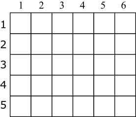
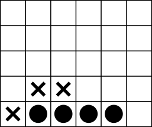
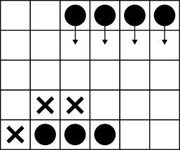
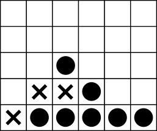
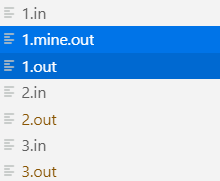
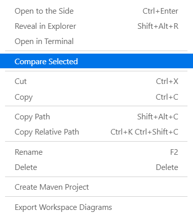

# Fundamentos da Programação 2022 2023 - [IADE - UE](https://www.iade.europeia.pt/) <!-- omit in toc -->

## Projeto <!-- omit in toc -->

- [Datas Relevantes](#datas-relevantes)
- [Utilização](#utilização)
  - [Compilar e executar](#compilar-e-executar)
  - [Gerar documentação](#gerar-documentação)
- [Descrição](#descrição)
  - [Colocação de peças](#colocação-de-peças)
  - [Parâmetros de jogo](#parâmetros-de-jogo)
- [Instruções](#instruções)
  - [Registar jogador (RJ)](#registar-jogador-rj)
  - [Remover jogador (EJ)](#remover-jogador-ej)
  - [Listar jogadores (LJ)](#listar-jogadores-lj)
  - [Iniciar Jogo (IJ)](#iniciar-jogo-ij)
  - [Desistir (D)](#desistir-d)
  - [Detalhes do Jogo (DJ)](#detalhes-do-jogo-dj)
  - [Colocar Peça (CP)](#colocar-peça-cp)
  - [Visualizar resultado (VR)](#visualizar-resultado-vr)
  - [Gravar (G)](#gravar-g)
  - [Ler (L)](#ler-l)
- [Estrutura do projeto](#estrutura-do-projeto)
- [Testes de *input*/*output*](#testes-de-inputoutput)
  - [Utilização de testes](#utilização-de-testes)
- [Entrega](#entrega)
- [Prova de Autoria](#prova-de-autoria)
- [Tecnologias](#tecnologias)
- [Grupo de trabalho](#grupo-de-trabalho)
- [Avaliação](#avaliação)

## Datas Relevantes

| Data              | Evento                 |
| ------------------------- | ------------------------------ |
| 31/10/2022        | Disponibilização do enunciado. |
| 15/01/2023 23:59:59       | Entrega final do trabalho.     |
| 16/01/2023 --- 21/01/2023 | Provas de autoria.             |

## Utilização

### Compilar e executar

```
gcc main.c -o main
./main
```

### Gerar documentação

```
sudo apt install doxygen
doxygen doxygenfile
```

É criado um diretório `doc/`, com a documentação gerada. Dentro de `doc/html/` encontra-se o ficheiro `index.html`, que pode ser aberto no browser.

## Descrição

Pretende-se a implementação de um jogo semelhante ao 4 em linha, como ilustrado pela Figura 1. A principal diferença está no número variável de peças, i.e., não está limitado a 4.



Figura 1: Grelha Vazia



Figura 2: Exemplo de jogo terminado, com tamanho de sequência vencedora igual a 4.

O jogo decorre numa grelha vertical, onde são colocadas peças pelo topo. Cada peça desce até à base da grelha, ou até ao topo da última peça colocada nessa posição.

Além do número variável de peças necessárias para ganhar o jogo, cada jogador dispõe de um número limitado de peças especiais, i.e., sequências de peças com várias dimensões. Embora no jogo tradicional só seja possível colocar uma peça de cada vez, nesta versão será possível colocar estas sequências.

Deve ser possível registar jogadores, e registar o número vitórias e jogos jogados de cada um.

Para aprovação em Fundamentos da Programação, o trabalho tem que implementar as instruções descritas nas (instruções)(#instruções). Estas descrevem um conjunto de instruções com as quais os jogadores, através do terminal, interagem com o programa. A interação deve seguir rigorosamente as regras descritas pela nas [instruções](#instruções), já que o trabalho será validado com recurso a conjunto de testes rigorosos. Serão disponibilizados testes de treino, semelhantes aos utilizados na validação

### Colocação de peças

O jogo original permite colocar apenas uma peça de cada vez, ate um dos jogadores conseguir uma sequência vertical, horizontal, ou diagonal de peças com dimensão 4 (como ilustrado na Figura 1). Nesta versão, além de ser possível varia o número de peças necessário para vencer, vai ser possível colocar também várias peças de uma só vez, através das peças especiais (ver Figuras 3 e 4).



Figura 3: Colocação de peça especial com tamanho 4, na posição 3 D, ou 6 E.



Figura 4: Situação após colocação da peça especial.

Cada jogador tem disponíveis peças unitárias ilimitadas, e um conjunto de sequências de peças, i.e., peças especiais. A colocação de peças especiais é feita indicando a posição inicial, e o sentido (i.e., esquerda (`E`) ou direita(`D`)). As peças descem na grelha e ficam colocadas de acordo com a ocupação atual (ver Figura 4).

### Parâmetros de jogo

Um jogo opõe dois jogadores registados, e tem os seguintes parâmetros:

- $w$ - Comprimento da grelha, em peças, onde $w \in \mathbb{N}$;
- $h$ - Altura da grelha em peças, onde $h \in \mathbb{N}, \lceil\frac{w}{2}\rceil \leq h \leq w$;
- $n$ - Número de peças em linha para determinar a vitória (i.e., `TamanhoSequência`), onde $n \in \mathbb{N}, n \leq w$;
- $S$ - Conjunto de tamanhos de peças especiais disponível para cada jogador, onde $\forall s \in S : S \in \mathbb{N}, s < n$. E.g., $n=5, S=[3,3,4]$, implica que cada jogador dispõe de duas peças especiais de 3 peças, e uma peça especial de 4 peças, além do número ilimitado de peças unitárias.

## Instruções

Na descrição das várias instruções é indicada a sua sintaxe. Quer para as entradas, como para as saídas, as palavras são separadas por espaços em branco, e cada linha é terminada por um caráter fim de linha (`\n`).

Para cada instrução são indicadas as expressões de saída, quer para execuções com sucesso, quer para insucesso.

No caso de insucesso só deve surgir uma mensagem de erro. Verificando-se várias situações de insucesso em simultâneo, deve surgir apenas a mensagem do primeiro cenário de insucesso considerado, de acordo com a ordem de saídas de insucesso descritas para cada instrução. Qualquer cenário de insucesso não considerado pode ser ignorado, porque não será testado.

Caso o utilizador introduza uma instrução inválida, ou seja, não prevista na lista de instruções desta secção, ou um número de parâmetros errado para uma instrução existente, o programa deve escrever:

    Instrução inválida.

Pode assumir que não existem erros de representação de informação (e.g., texto em vez de valores numéricos).

A descrição de cada instrução pretende ser exaustiva, sem ambiguidades, e suficiente. Não deve ser possível optar entre vários comportamentos possíveis na mesma situação. Se essa situação ocorrer deve entrar em contacto com equipa docente.

A implementação não deve suportar mais instruções do que [as que estão descritas](#instruções). No entanto, nos testes públicos e privados não existirão instruções a começar pela letra `X`, pelo que pode ser utilizada para instruções convenientes ao desenvolvimento.

O programa termina quando for introduzida uma linha em branco, fora do contexto de uma instrução.

### Registar jogador (RJ)

Regista um novo jogador. Cada jogador tem um nome único. Não existe limite para o número de jogadores registados.

`Nome` é um nome de um jogador.

Entrada:

        RJ Nome

Saída com sucesso:

        Jogador registado com sucesso.

Saída com insucesso:

- Quando já existe um jogador com o mesmo nome:

        Jogador existente.

### Remover jogador (EJ)

Remove um jogador previamente registado, se este não estiver a participar no jogo em curso.

`Nome` é um nome de um jogador.

Entrada:

        EJ Nome

Saída com sucesso:

        Jogador removido com sucesso.

Saída com insucesso:

- Quando o jogador indicado não existe:

        Jogador não existente.

- Quando o jogador indicado participa no jogo em curso:

        Jogador participa no jogo em curso.

### Listar jogadores (LJ)

Lista os jogadores registados por ordem alfabética de `Nome`, indicando o número de jogos jogados e vitórias.

`Nome` é um nome de um jogador, `Jogos` é o número de jogos jogados por um jogador, e `Vitórias` é o número de vitórias de um jogador.

Entrada:

        LJ

Saída com sucesso (deve surgir uma linha por cada jogador registado):

        Nome Jogos Vitórias
        Nome Jogos Vitórias
        ...

Saída com insucesso:

- Quando não existem jogadores registados.

        Não existem jogadores registados.

### Iniciar Jogo (IJ)

Inicia um novo jogo, se não estiver ainda um jogo iniciado. É necessário indicar o nome dos jogadores que irão participar, as dimensões da grelha, o tamanho da sequência vencedora, e as peças especiais disponíveis. Os jogadores têm que estar previamente registados. O jogo inicia indicando o nome dos jogadores que nele participam por ordem alfabética.

`Nome` é um nome de um jogador, `Comprimento` e `Altura` são as dimensões da grelha de jogo, `TamanhoSequência` é o tamanho da sequência vencedora, e `TamanhoPeça` é o tamanho de uma peça especial.

Nenhum valor de `TamanhoPeça` pode ser igual ou superior a `TamanhoSequência`.

Entrada:

        IJ Nome Nome
        Comprimento Altura TamanhoSequência
        TamanhoPeça TamanhoPeça ... TamanhoPeça

Saída com sucesso:

        Jogo iniciado entre Nome e Nome.

Saída com insucesso:

- Quando já existe um jogo em curso.

        Existe um jogo em curso.

- Quando algum dos jogadores indicados não se encontra registado.

        Jogador não registado.

- Quando as dimensões da grelha não respeitam as regras indicadas na  secção sobre [parâmetros do jogo](#parâmetros-de-jogo).

        Dimensões de grelha inválidas.

- Quando tamanho da sequência vencedora não respeita as regras indicadas na Secção sobre [parâmetros do jogo](#parâmetros-de-jogo).

        Tamanho de sequência inválido.

- Quando alguma dimensão das peças especiais não respeita as regras indicadas na Secção sobre [parâmetros do jogo](#parâmetros-de-jogo).

        Dimensões de peças especiais inválidas.

### Desistir (D)

Um jogador pode desistir do jogo em curso do qual faz parte, pelo que o outro jogador regista uma vitória. Ambos registam mais um jogo jogado. Caso os dois jogadores desistam, ambos somam um jogo jogado, sem vitória atribuída.

`Nome` é um nome de um jogador.

Entrada:

        D Nome[ Nome]

Saída com sucesso:

        Desistência com sucesso. Jogo terminado.

Saída com insucesso:

- Quando não existe um jogo em curso:

        Não existe jogo em curso.

- Quando um dos jogadores indicados não participa no jogo em curso:

        Jogador não participa no jogo em curso.

### Detalhes do Jogo (DJ)

Mostra informação sobre o jogo em curso: tamanho da grelha, jogadores por ordem alfabética, e tipo e quantidade de peças especiais disponíveis para cada jogador.

`Comprimento` e `Altura` são as dimensões da grelha de jogo, `Nome` é um nome de um jogador, `TamanhoPeça` é o tamanho de uma peça especial, e `Quantidade` é o número de peças especiais atualmente disponíveis para o jogador.

Entrada:

        DJ

Saída com sucesso (devem surgir duas mensagens, ordenadas por nome de jogador):

        Comprimento Altura
        Nome
        TamanhoPeça Quantidade
        TamanhoPeça Quantidade
        ...
        Nome
        TamanhoPeça Quantidade
        TamanhoPeça Quantidade
        ...

Saída com insucesso:

- Quando não existe um jogo em curso:

        Não existe jogo em curso.

### Colocar Peça (CP)

Um jogador coloca uma peça, se fizer parte do jogo em curso, e for a sua vez. Se nenhum jogador tiver colocado peças no jogo em curso, qualquer um pode ser o primeiro.

`Nome` é um nome de um jogador, `TamanhoPeça` é o tamanho da peça a colocar, `Posição` é a coordenada horizontal onde a peça será colocada, e `Sentido` é o sentido (`E` ou `D`), na horizontal, para onde a peça será colocada (ver [colocação de peças](#colocação-de-peças) ). `Sentido` é opcional, podendo ser omitido quando a peça tem tamanho 1.

Entrada:

    CP Nome TamanhoPeça Posição[ Sentido]

Saída com sucesso:

- Quando a peça colocada possibilita uma sequência vencedora.

        Sequência conseguida. Jogo terminado.

- Após colocação da peça.

        Peça colocada.

Saída com insucesso:

- Quando não existe jogo em curso.

        Não existe jogo em curso.

- Quando o jogador indicado não participa no jogo em curso.

        Jogador não participa no jogo em curso.

- Quando não for possível utilizar uma peça com o tamanho indicado (por inexistência ou indisponibilidade).

        Tamanho de peça não disponível.

- Quando a posição e sentido indicados não permitirem a colocação da peça, de acordo com as regras indicadas nos [parâmetros do jogo](#parâmetros-de-jogo).

        Posição irregular.

### Visualizar resultado (VR)

Mostra o estado atual da grelha do jogo em curso, indicando o conteúdo de cada posição. As posições são mostradas de cima para baixo, da esquerda para a direita, indicando linha, coluna, e conteúdo (ver coordenadas na Figura 1).

`Conteúdo` pode ser `Vazio`, caso nenhuma peça se encontra na posição, ou o nome do jogador com peça na posição. `Altura` e `Comprimento` são as dimensões da grelha.
  
Entrada:

        VR
  
Saída com sucesso:

        1 1 Conteúdo
        1 2 Conteúdo
        ...
        Altura Comprimento Conteúdo
  
Saída com insucesso:

- Quando não existe jogo em curso.

        Não existe jogo em curso.

### Gravar (G)

Grava a lista de jogadores, resultados, e estado do jogo em curso (se existir) em ficheiro.

Entrada:

        G

Saída com sucesso:

        Jogo gravado.

Saída com insucesso:

- Quando ocorre um erro na gravação:

        Ocorreu um erro na gravação.

### Ler (L)

Lê a lista de jogadores, resultados, e estado do jogo em curso (se existir) de ficheiro.

Entrada:

        L

Saída com sucesso:

        Jogo carregado.

Saída com insucesso:

- Quando ocorre um erro na leitura:

        Ocorreu um erro no carregamento.

## Estrutura do projeto

A estrutura mínima do projeto deve ser a seguinte:

      projeto
      |-- main.c : ficheiro com o programa.
      |-- iotests : diretório com testes de output, a distribuir pela docência
      |-- figures : diretório com imagens utilizadas neste ficheiro
      |-- README.md : este ficheiro
      |-- REPORT.md : relatório do projeto

O repositório de referência está disponível em <https://github.com/IADE-FP/IADE-FP-2022-2023-Projeto>

Para efetuar a atualizações:

1. Registar o repositório como `upstream` (só deve acontecer uma vez)

        git remote add upstream https://github.com/IADE-FP/IADE-FP-2022-2023-Projeto

2. Atualizar o `upstream` (sempre que existirem atualizações)

        git fetch upstream

3. Obter as alterações (e.g., ficheiro `README.md`)

        git checkout upstream/main README.md

## Testes de *input*/*output*

O projeto é validado através de um conjunto de baterias de teste de *input*/*output*.

Cada bateria é constituída por um ficheiro de entrada e outro e saída. O ficheiro de entrada contém uma sequência de instruções a passar pelo programa que, por sua vez, deve produzir uma sequência de saída *exatamente* igual ao ficheiro de saída. A comparação será feita *byte* a *byte*, pelo que não podem existir quaisquer diferenças para o programa ser considerado válido.

As baterias serão distribuídas através do repositório git de referência, na diretoria `iotests` (será necessário registar o repositório de referência como `upstream`, de acordo com as instruções na secção sobre [estrutura do projeto](#estrutura-do-projeto)).

Os grupos de trabalho devem utilizar as baterias públicas para validar o desenvolvimento do projeto.

### Utilização de testes

Os testes disponibilizados devem ser utilizados por ordem, já que os cenários descritos num teste podem depender dos cenários dos testes anteriores. Na linha de comandos Windows (Command Prompt) e em GNU Linux/MacOs, cada teste deve ser utilizado da seguinte forma:

    main < 1.in > 1.mine.out

A instrução `<` redireciona o *standard input* para o ficheiro indicado, e a instrução `>` redireciona o *standard output* para o ficheiro indicado (cria se não existir, e escreve por cima se existir).

No exemplo, o ficheiro `1.in` contém várias instruções para testar o programa. O ficheiro `1.out` contém as saídas correspondentes às instruções no ficheiro `1.in`. O ficheiro `1.mine.out` será criado com as saídas que o programa gerar. Os ficheiros `1.out` e `1.mine.out` devem ser
idênticos.

A comparação entre ficheiros pode ser feita na linha de comandos, recorrendo ao programa `comp` em Windows, ou `diff` em Linux e MacOS.

A comparação também pode ser feita recorrendo a alguns IDEs ou editores de texto, tal como o [*Visual Studio Code*](https://code.visualstudio.com/). Para tal, abra o diretório do projeto em *File - Open Folder*. Selecione o diretório do projeto confirme em *Select Folder*. Caso não esteja visível, abra o explorador de ficheiros do *Visual Studio Code* em *View - Explorer*.

Selecione os dois ficheiros a comparar (selecione um, e selecione o outro enquanto pressiona na tecla `Ctrl`, ou `Cmd` em MacOS).



Com os dois ficheiros selecionados, utilize o botão direito do rato em cima da seleção para obter um menu. Escolha *Compare Selected*.



O *Visual Studio Code* apresenta os dois ficheiros com as diferenças a vermelho e verde. Caso não existam diferenças, as linhas dos dois ficheiros surgem sem cores.

## Entrega

A entrega do projeto é feita no *GitHub Classroom* e na plataforma de *e-learning*.

Deve existir, na raiz do repositório, um ficheiro de relatório `REPORT.md` com a identificação dos elementos do grupo de trabalho, e eventuais comentários relativos a estratégias de implementação adotadas, e/ou à distribuição de tarefas.

A ausência de identificação individual no ficheiro de relatório implica a anulação da participação individual no projeto.

O código fonte entregue será sujeito a validação por um conjunto de testes reservado para esse efeito, e será compilado com a seguinte instrução:

```bash
gcc main.c -o main
```

A compilação deve gerar o programa `main` no diretório atual, que será executado com as instruções dos testes.

A entrega no *e-learning* corresponde a um ficheiro `zip` do repositório *GitHub Classroom*, excluindo eventuais ficheiros compilados.

## Prova de Autoria

Todos os projetos entregues serão sujeitos a prova de autoria. Para esse efeito, cada grupo terá que efetuar uma discussão com a docência, de forma a demonstrar que o código entregue foi de facto feito pelo grupo, e que a distribuição de trabalho foi equilibrada.

O calendário das provas de autoria será disponibilizado no *e-learning*, após o prazo de entrega da implementação do projeto.

A não comparência na prova de autoria implica a anulação da participação individual no projeto.

## Tecnologias

O projeto deve ser implementado em C (C11, gcc versão 8.1, ou superior).

Não podem ser utilizadas bibliotecas externas à distribuição padrão. No caso de dúvida, o corpo docente deve ser consultado.

## Grupo de trabalho

Os grupos de trabalho devem ter entre 3 e 4 pessoas, e são constituídos no início do semestre. Idealmente, todos os elementos do grupo devem participar em todos os aspetos do projeto. No entanto, pode existir divisão de tarefas, sendo que esta deve ser equilibrada.

Grupos com um número diferente de pessoas devem ser explicitamente autorizados pelo corpo docente.

## Avaliação

O projeto é avaliado com base em duas componentes: quantitativa (*A*), e qualitativa (*B*). A nota final do projeto é determinada por *(0.5 x A) + (0.5 x B)*.

| Instrução | Peso |
| --------- | :--: |
| RJ        |  2   |
| EJ        |  2   |
| LJ        |  2   |
| IJ        |  2   |
| D         |  2   |
| DJ        |  2   |
| CP        |  2   |
| VR        |  2   |
| G         |  2   |
| L         |  2   |

A avaliação qualitativa irá considerar que existem várias formas de resolver o problema descrito, mas exige-se a utilização dos instrumentos e métodos apresentados na unidade curricular, nomeadamente:

- Separação entre interface, dados, e lógica da aplicação;
- Justificação clara para as variáveis e operações implementadas;
- Organização da solução coerente com a metodologia apresentada na unidade curricular.

A implementação estrita de todas as instruções descritas neste enunciado assegura, sem prejuízo de reprovação por irregularidade académica, a nota mínima de 10 valores.

As notas finais do projeto serão disponibilizadas na plataforma de *e-learning*.
